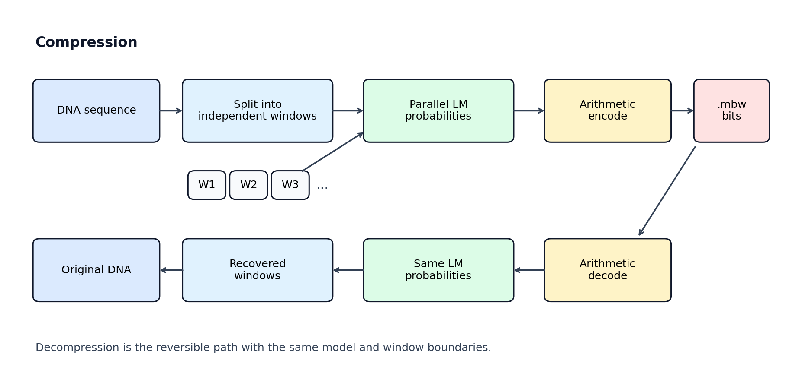
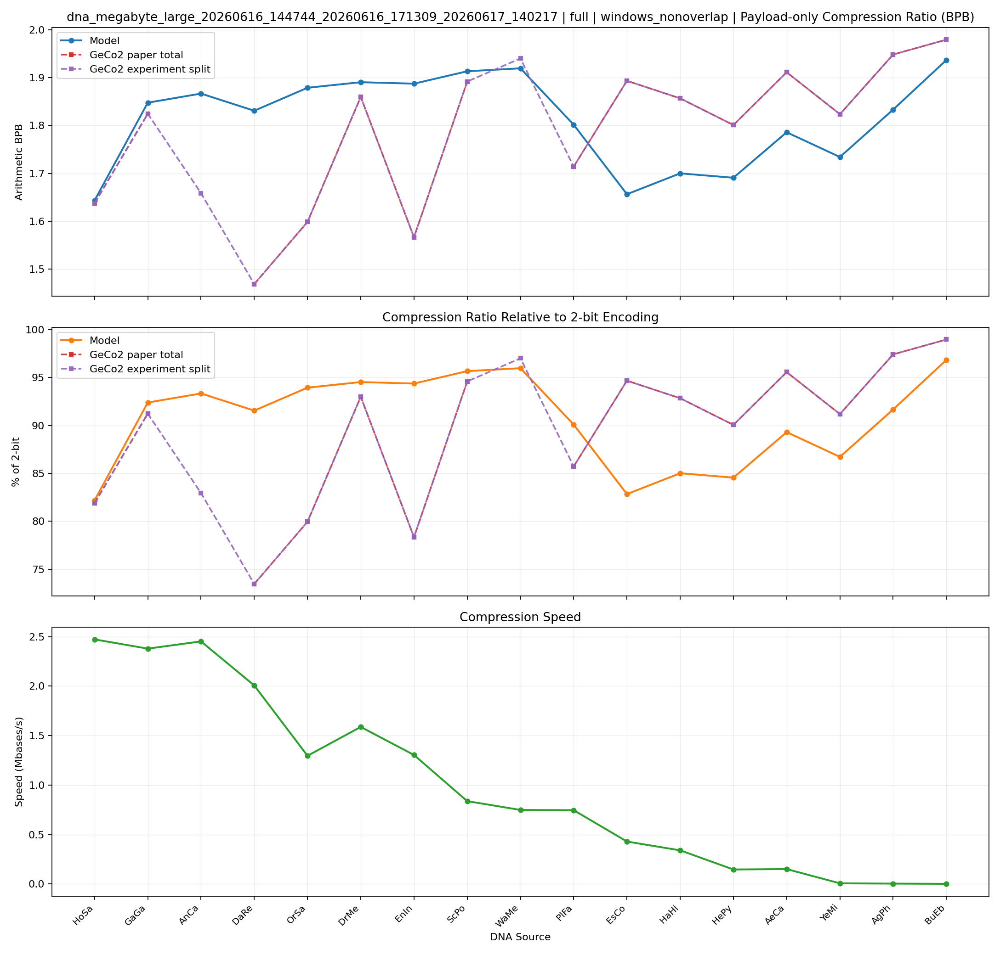
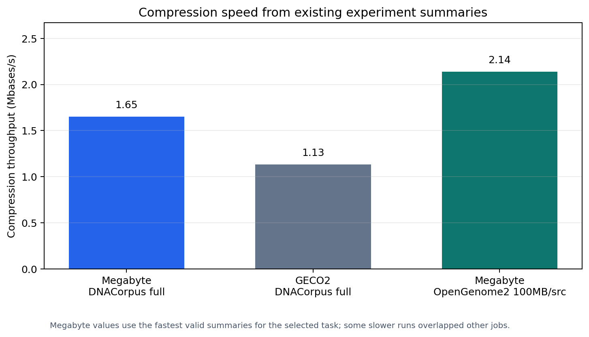
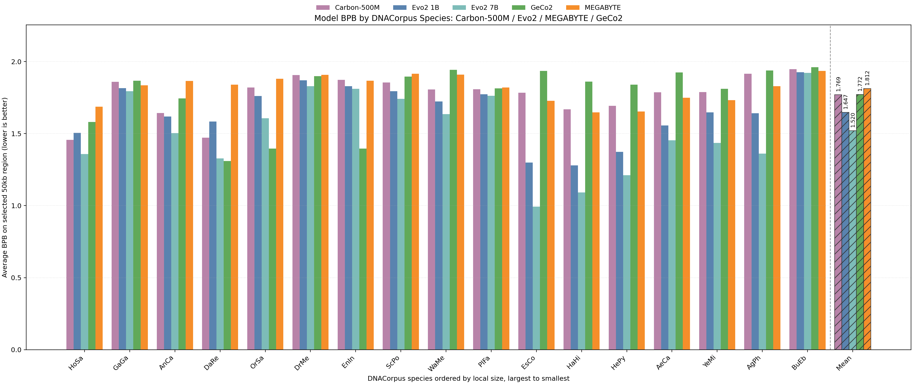
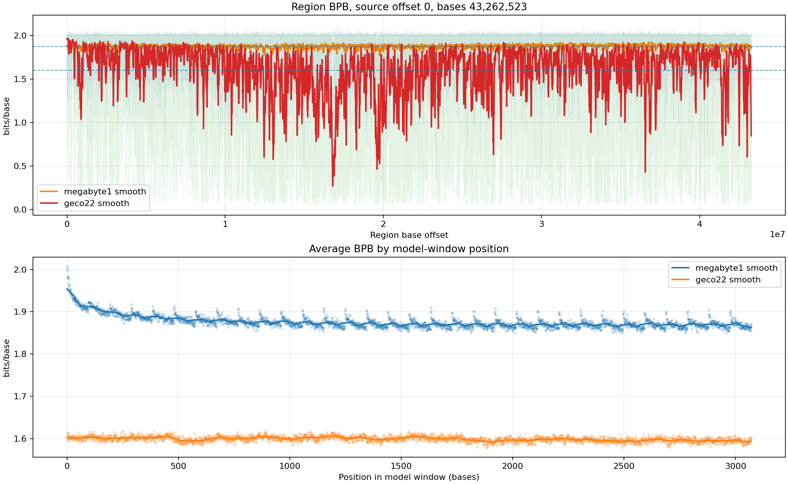
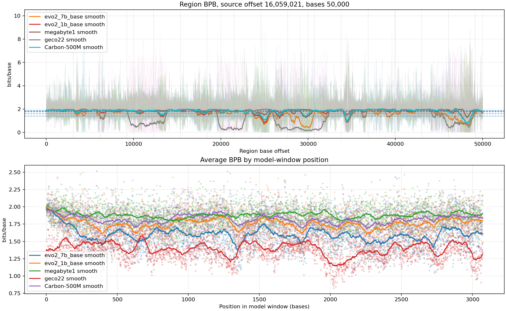

# DNACompress 阶段性记录

本仓库实现 DNA lossless compression，通过把自回归语言模型输出的碱基概率接入算术编码，与传统算法压缩器 GECO2 对比。最新实验结果目录在 [`outputs/dna_megabyte_large_opengenome2_9`](outputs/dna_megabyte_large_opengenome2_9)，这是当前 MEGABYTE 最新的有完整压缩率可视化的结果。

## 学习式 LM 压缩原理

学习式压缩器把 DNA 序列切成大量窗口。每个窗口独立送入语言模型，模型给出每个位置的下一个符号概率，算术编码器用这些概率把真实符号序列编码成 bitstream。解压时，解码器用同一个模型、同一套窗口边界和同样的概率计算过程，按算术编码的可逆规则还原原始 DNA。



这个设计的优势是强并行性：窗口之间不互相依赖，可以同时在多 GPU 上做模型推理。代价是窗口外的长程重复和跨窗口统计信息默认不可见。GECO2 是串行统计压缩器，可以持续更新上下文统计，因此在真核生物序列的长程重复区域上仍然很强。

当前比较对象：

| 类型 | 压缩器 / 模型 | 本地来源 |
|---|---|---|
| 学习式 | 自训练 MEGABYTE | [`outputs/dna_megabyte_large_opengenome2_9`](outputs/dna_megabyte_large_opengenome2_9) |
| 学习式 | Carbon-500M FNS | [`third_party/Carbon-500M-fns`](third_party/Carbon-500M-fns) |
| 学习式 | Evo2 1B base | [`third_party/evo2_1b_base`](third_party/evo2_1b_base) |
| 学习式 | Evo2 7B base | [`third_party/evo2_7b_base`](third_party/evo2_7b_base) |
| 基于算法 | GECO2 | `/home/Liang_junnan/miniconda3/bin/GeCo2` |

## 压缩率结果

DNACorpus 上，MEGABYTE 的压缩率结果来自 `outputs/dna_megabyte_large_opengenome2_9/statistics_dnacorpus_full`。该目录下的结果使用 `windows_nonoverlap` 编码方式，与 GECO2 的结果一起展示。



各物种的碱基平均码长 bpb（不考虑元数据损耗）如下；`Delta bpb` 为 MEGABYTE - GECO2，负值表示 MEGABYTE 更低：

| 物种 | 类型 | MEGABYTE bpb | GECO2 bpb | Delta bpb |
|---|---|---:|---:|---:|
| HoSa | 真核 | 1.644 | 1.638 | +0.006 |
| GaGa | 真核 | 1.848 | 1.825 | +0.023 |
| AnCa | 真核 | 1.867 | 1.659 | +0.208 |
| DaRe | 真核 | 1.831 | 1.469 | +0.362 |
| OrSa | 真核 | 1.879 | 1.599 | +0.280 |
| DrMe | 真核 | 1.890 | 1.860 | +0.031 |
| EnIn | 真核 | 1.887 | 1.567 | +0.321 |
| ScPo | 真核 | 1.913 | 1.892 | +0.021 |
| WaMe | 真核 | 1.919 | 1.940 | -0.021 |
| PlFa | 真核 | 1.802 | 1.714 | +0.087 |
| EsCo | 原核 | 1.657 | 1.893 | -0.237 |
| HaHi | 原核 | 1.700 | 1.857 | -0.157 |
| HePy | 原核 | 1.691 | 1.801 | -0.110 |
| AeCa | 原核 | 1.786 | 1.911 | -0.125 |
| YeMi | 病毒/噬菌体 | 1.734 | 1.824 | -0.089 |
| AgPh | 病毒/噬菌体 | 1.833 | 1.948 | -0.115 |
| BuEb | 病毒/噬菌体 | 1.937 | 1.979 | -0.043 |

速度来自 [`docs/assets/readme_metrics_summary.csv`](docs/assets/readme_metrics_summary.csv)。在一些短序列上窗口序列较少，无法跑满GPU，因而速度下降。保证速度不降的最小序列大小大约为30MB。



Carbon、Evo2、GECO2 和 MEGABYTE 的 50kb 测试序列 bpb 柱状图适合看不同生物类群上的压缩表现差异。该图来自 `outputs/dna_megabyte_large_opengenome2_9/region_bpb_compare_dnacorpus_50kb_seed12345_evo2_1b_7b_megabyte_geco2/combined_species_average_bpb_bar.png`。



在这些 50kb 抽样测试区域上，可以看到明显的物种差异，说明学习式压缩与算法式压缩的表现差异：最强的学习式压缩模型 Evo2 7B 在 EsCo、HaHi、HePy、AeCa 等原核或小基因组上显著优于 GECO2；而在 OrSa、DaRe、EnIn 等真核序列上，GECO2 的串行统计仍能显著受益于长程重复结构。HoSa 是一个例外，Carbon 和 Evo2 也表现很强，可能是因为人类基因组测序精度高，记录下来的局部重复模式多，在在训练数据中占比较大，模型预训练充分。

## 长程 bpb 观察

下面两张曲线都选用 OrSa （一种水稻，真核物种）。第一张是全序列各位置 bpb 的细粒度展示，用于观察长区域内的 bpb 变化；第二张来自 50kb 抽样测试区域的多模型对比，用于把 Carbon、Evo2、GECO2 和 MEGABYTE 放在同一段真核植物序列上比较。





这组结果说明当前窗口式 LM 压缩的主要矛盾：序列被分成一个个单独的窗口样本处理，模型根据预训练中见过的样本给出预测，而无法充分利用本序列的统计信息，不能记忆常见重复序列，在大尺度上 bpb 整体表现为一条直线；GECO2 通过串行统计保留本序列历史，遇到本序列中常见的重复序列时容易利用远距离记忆，可以观察到其 bpb 表现在远超窗口长度的较大尺度上波动；原核序列基因更紧凑，远距离相关性较小，只要模型预训练知识充分，学习式压缩器在这些来源上就容易超过 GECO2。

## 下一步方向

下一步希望保持窗口并行压缩框架，补充一个模型以外的预测概率来源：

1. 在所有参与并行的窗口中采样前缀序列。
2. 基于这些前缀序列统计频率，构建预测器，估计当前窗口内符号概率。
3. 将统计概率与 LM softmax 概率动态加权融合，送入算术编码器。

这相当于在窗口中可见的局部序列之外，还增加一个来自前缀采样的全局视角。这个全局区域最大可覆盖25MB，已接近 GECO2 的记忆机制窗口范围，理论上可以设计类似的基于统计的机制，构建一个新的独立预测器。目标改善真核长程重复区域中窗口独立压缩的劣势。

### 上下文长度机制实验

当前新增的机制实验固定同一来源的三个确定性、互不重叠连续片段，同步扩大 gLM 和 STAP 的对齐窗口，检验更长 independent-window context 是否能够消除 STAP 的融合收益。首个正式 pilot 使用 OrSa 的三个 2,359,296-bp 片段（合计覆盖 16.36%），窗口长度为 6144 到 196608 bp 的二分序列。入口为 `scripts/run_dnacorpus_context_length_probe.py`；实验保留可复用的模型/STAP target-probability traces，融合结果从源 trace 离线计算。

## 仓库导航

### 训练与恢复

训练入口是 [`scripts/run_dna_training.py`](scripts/run_dna_training.py)，配置文件在 [`configs`](configs)。训练输出默认写入 `outputs/<run>/`，常见文件包括：

- `best.pt`：验证集最佳 checkpoint。
- `last.pt`：最近一次保存的 checkpoint，用于 resume。
- `resolved_config.json`：实际展开后的配置。
- `training_metrics.jsonl`：本地训练与验证指标。
- `wandb/`：W&B 本地记录。

OpenGenome2 indexed FASTA 训练示例在 `scripts/run_dna_training.py` 文件的头部。恢复训练通常使用：

```bash
CUDA_VISIBLE_DEVICES=3 python scripts/run_dna_training.py \
  --config configs/dna_megabyte_large.json \
  --mode all \
  --init-from resume \
  --pretrained-weight-path outputs/dna_megabyte_large_opengenome2_9/last.pt \
  --sequence-source-mode indexed_fasta \
  --fasta-index-dir /data/students/Liang_junnan/opengenome2_subset/index \
  --wandb-project dna-compress \
  --wandb-name dna_megabyte_large_opengenome2_resume
```

### 压缩测试

DNACorpus 上的真实 MEGABYTE Window Codec 压缩入口是 [`scripts/run_dna_compression.py`](scripts/run_dna_compression.py)。OpenGenome2 FASTA 子集压缩入口是 [`scripts/run_dna_compression_opengenome2.py`](scripts/run_dna_compression_opengenome2.py)。历史统计式或非 `.mbw` 路线保留在 legacy 脚本中。

DNACorpus full source 压缩示例：

```bash
python scripts/run_dna_compression.py \
  --run-dir outputs/dna_megabyte_large_opengenome2_9 \
  --checkpoint-tag best \
  --dataset-dir datasets/DNACorpus \
  --sequence-source-mode auto \
  --multi-sequence-mode separate \
  --split full \
  --compression-modes windows_nonoverlap \
  --compression-sample-bytes 0 \
  --arithmetic-coding-mode model_symbol \
  --arithmetic-merge-size 3 \
  --window-codec-batch-size 8192 \
  --geco2-baseline dnacorpus_fullsplit \
  --skip-codec-baselines
```

### 统计与可视化

- [`scripts/export_statistics.py`](scripts/export_statistics.py)：把 W&B payload 风格的指标导出为本地 CSV/JSON。
- [`scripts/plot_compression_curves.py`](scripts/plot_compression_curves.py)：从 `compression_compare.json` 生成压缩率、2-bit 百分比和速度曲线。
- [`scripts/plot_fullsplit_geco2_comparison.py`](scripts/plot_fullsplit_geco2_comparison.py)：生成 full split 的模型与 GECO2 对比图。
- [`scripts/run_dna_region_bpb_probe.py`](scripts/run_dna_region_bpb_probe.py)：在固定 region 上比较 MEGABYTE、Carbon、Evo2、GECO2 的 bpb 曲线。
- [`scripts/build_readme_assets.py`](scripts/build_readme_assets.py)：只读现有输出，生成本 README 使用的轻量图表和数值表。

### 数据集与准备脚本

| 数据 | 说明 | 文档 / 脚本 |
|---|---|---|
| DNACorpus | 17 个扁平 A/C/G/T DNA 文件，覆盖真核、原核、病毒等来源 | [`docs/DNACORPUS_SPECIES_NOTES.md`](docs/DNACORPUS_SPECIES_NOTES.md) |
| OpenGenome2 subset | indexed FASTA，大规模多来源训练数据 | [`docs/OPENGENOME2_SOURCES_NOTES.md`](docs/OPENGENOME2_SOURCES_NOTES.md) |
| Ensembl raw | 按物种和染色体/序列保留边界的 FASTA | [`docs/ENSEMBL_RAW_SPECIES_NOTES.md`](docs/ENSEMBL_RAW_SPECIES_NOTES.md), [`scripts/download_ensembl_fastas.sh`](scripts/download_ensembl_fastas.sh) |
| Carbon HF corpus | Hugging Face Bio Carbon pretraining corpus，parquet 转 FASTA 后复用 indexed FASTA 管线 | [`scripts/run_carbon_hf_postprocess_after_download.sh`](scripts/run_carbon_hf_postprocess_after_download.sh), [`scripts/build_carbon_hf_fasta_index.py`](scripts/build_carbon_hf_fasta_index.py) |
| FASTA index | 大 FASTA 的 fragment/index 构建 | [`scripts/build_fasta_fragment_index_parallel.py`](scripts/build_fasta_fragment_index_parallel.py) |

## 权重来源

| 模型 / 工具 | 本地路径 | 下载或来源 |
|---|---|---|
| 自训练 MEGABYTE | `outputs/dna_megabyte_large_opengenome2_9/best.pt`, `outputs/dna_megabyte_large_opengenome2_9/last.pt` | 本仓库训练输出；实现参考 `https://github.com/shjwudp/megabyte` |
| Carbon-500M FNS | `third_party/Carbon-500M-fns/` | `env -u http_proxy -u https_proxy -u HTTP_PROXY -u HTTPS_PROXY HF_ENDPOINT=https://hf-mirror.com hf download HuggingFaceBio/Carbon-500M --revision fns --local-dir third_party/Carbon-500M-fns`; 源 `https://huggingface.co/HuggingFaceBio/Carbon-500M/tree/fns` |
| Carbon-3B | `third_party/Carbon-3B/` | `env -u http_proxy -u https_proxy -u HTTP_PROXY -u HTTPS_PROXY HF_ENDPOINT=https://hf-mirror.com hf download HuggingFaceBio/Carbon-3B --local-dir third_party/Carbon-3B`; fused 管线可用 `--lm-backend carbon --carbon-preset 3b` |
| Evo2 1B base | `third_party/evo2_1b_base/evo2_1b_base.pt` | `https://huggingface.co/arcinstitute/evo2_1b_base` |
| Evo2 7B base | `third_party/evo2_7b_base/evo2_7b_base.pt` | `https://huggingface.co/arcinstitute/evo2_7b_base` |
| megaDNA | `third_party/megaDNA/checkpoints/megaDNA_phage_145M.pt` | `https://huggingface.co/lingxusb/megaDNA_updated` |
| GECO2 | `/home/Liang_junnan/miniconda3/bin/GeCo2` | 算法压缩器，无模型权重 |

## 主要结果来源

- MEGABYTE vs GECO2 压缩率：[`outputs/dna_megabyte_large_opengenome2_9/statistics_dnacorpus_full/compression_curves/full_windows_nonoverlap_payload_only_compression_curves.png`](outputs/dna_megabyte_large_opengenome2_9/statistics_dnacorpus_full/compression_curves/full_windows_nonoverlap_payload_only_compression_curves.png)
- 压缩率数据表：[`outputs/dna_megabyte_large_opengenome2_9/statistics_dnacorpus_full/compression_ratio_summary.csv`](outputs/dna_megabyte_large_opengenome2_9/statistics_dnacorpus_full/compression_ratio_summary.csv)
- 速度数据表：[`outputs/dna_megabyte_large_opengenome2_9/statistics_dnacorpus_full/compression_speed_summary.csv`](outputs/dna_megabyte_large_opengenome2_9/statistics_dnacorpus_full/compression_speed_summary.csv)
- 多模型 region bpb 柱状图：[`outputs/dna_megabyte_large_opengenome2_9/region_bpb_compare_dnacorpus_50kb_seed12345_evo2_1b_7b_megabyte_geco2/combined_species_average_bpb_bar.png`](outputs/dna_megabyte_large_opengenome2_9/region_bpb_compare_dnacorpus_50kb_seed12345_evo2_1b_7b_megabyte_geco2/combined_species_average_bpb_bar.png)
- 多模型 region bpb 数据表：[`outputs/dna_megabyte_large_opengenome2_9/region_bpb_compare_dnacorpus_50kb_seed12345_evo2_1b_7b_megabyte_geco2/combined_species_average_bpb_bar_values.csv`](outputs/dna_megabyte_large_opengenome2_9/region_bpb_compare_dnacorpus_50kb_seed12345_evo2_1b_7b_megabyte_geco2/combined_species_average_bpb_bar_values.csv)
- OrSa 长程 bpb 曲线：[`outputs/dna_megabyte_large_opengenome2_9/full_bpb_probe_dnacorpus/OrSa/region_bpb_curve.png`](outputs/dna_megabyte_large_opengenome2_9/full_bpb_probe_dnacorpus/OrSa/region_bpb_curve.png)
- OrSa 多模型 region bpb 曲线：[`outputs/dna_megabyte_large_opengenome2_9/region_bpb_compare_dnacorpus_50kb_seed12345_evo2_1b_7b_megabyte_geco2/OrSa/region_bpb_combined_curve.png`](outputs/dna_megabyte_large_opengenome2_9/region_bpb_compare_dnacorpus_50kb_seed12345_evo2_1b_7b_megabyte_geco2/OrSa/region_bpb_combined_curve.png)
- GECO2 DNACorpus full baseline：[`outputs/dna_geco2_dnacorpus_fullsplit/compression_aggregate_by_split_mode.csv`](outputs/dna_geco2_dnacorpus_fullsplit/compression_aggregate_by_split_mode.csv)
