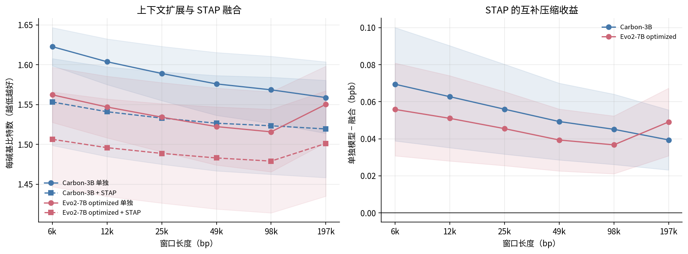
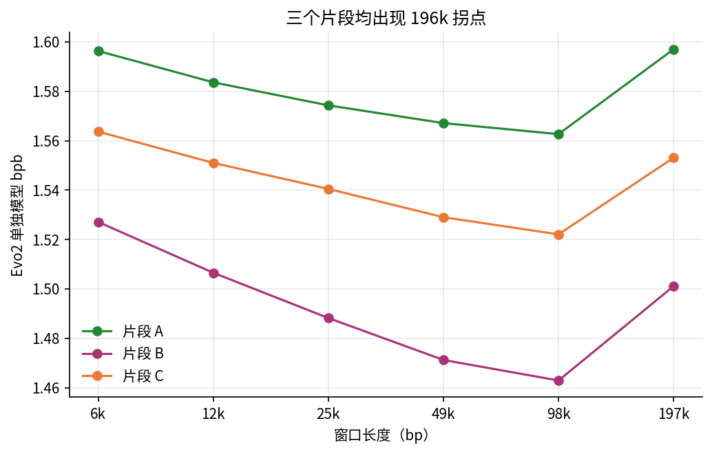
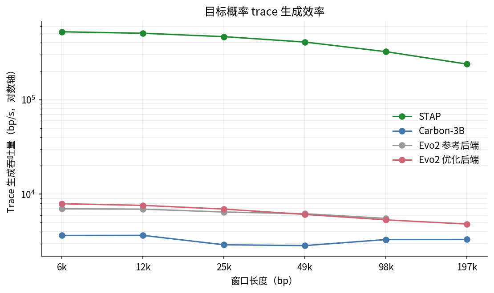

# OrSa 上下文长度实验：结果汇总与代码说明

## 完成状态

本轮预先约定的单物种主实验已经结束。三个固定片段、六个窗口长度上的 STAP、Carbon-3B、Carbon+STAP、Evo2 optimized 和 Evo2 optimized+STAP 均为 18/18。Evo2 reference（无官方 kernel）完成 6,144–98,304 bp 的 15/15；196,608 bp 因该后端的单层峰值显存限制不可运行，因此不把 reference 与 optimized 拼成一条曲线。

尚未运行的只有可选诊断：在 98,304 与 196,608 bp 之间补若干窗口，定位 Evo2 拐点。它不是完成主因果检验的必要条件。

## 实验口径

- OrSa 总长 43,262,523 bp；三个片段各 2,359,296 bp，合计 7,077,888 bp，占 16.36%。
- 起点为 6,094,848、20,447,232、34,799,616 bp，三段互不重叠。
- 窗口为 6,144、12,288、24,576、49,152、98,304、196,608 bp。
- 下表采用所有长度一致的 common mask：去掉每个 6,144 bp 基础块的首位置，共评价每段 2,358,912 个碱基。
- 数值为三个固定片段的等权均值；SD 是片段间样本标准差。收益定义为 `standalone − fused`，正值表示 STAP 融合更好。

## 主结果

| 模型 | 窗口（bp） | 单独模型 bpb（均值±SD） | +STAP bpb | STAP 收益（均值±SD） |
|---|---:|---:|---:|---:|
| Carbon-3B | 6,144 | 1.622810 ± 0.023983 | 1.553340 | 0.069469 ± 0.030604 |
| Carbon-3B | 12,288 | 1.603867 ± 0.028696 | 1.541121 | 0.062746 ± 0.027561 |
| Carbon-3B | 24,576 | 1.589124 ± 0.034057 | 1.533133 | 0.055991 ± 0.024266 |
| Carbon-3B | 49,152 | 1.576041 ± 0.039478 | 1.526708 | 0.049333 ± 0.020732 |
| Carbon-3B | 98,304 | 1.568615 ± 0.042142 | 1.523484 | 0.045131 ± 0.018994 |
| Carbon-3B | 196,608 | 1.558893 ± 0.044863 | 1.519486 | 0.039407 ± 0.016228 |
| Evo2 optimized | 6,144 | 1.562340 ± 0.034639 | 1.506480 | 0.055861 ± 0.025052 |
| Evo2 optimized | 12,288 | 1.547043 ± 0.038707 | 1.495990 | 0.051053 ± 0.023039 |
| Evo2 optimized | 24,576 | 1.534309 ± 0.043389 | 1.488809 | 0.045501 ± 0.019990 |
| Evo2 optimized | 49,152 | 1.522440 ± 0.048291 | 1.483082 | 0.039358 ± 0.016728 |
| Evo2 optimized | 98,304 | 1.515867 ± 0.050174 | 1.479135 | 0.036731 ± 0.015608 |
| Evo2 optimized | 196,608 | 1.550397 ± 0.048031 | 1.501311 | 0.049086 ± 0.018265 |



## 结果解释

Carbon 给出最干净的因果趋势：窗口从 6,144 扩大到 196,608 bp 时，单独模型改善 0.063917 bpb；与此同时 STAP 的额外收益从 0.069469 缩小到 0.039407 bpb，但没有消失。这支持“更长的窗口吸收了部分统计信息，但 independent-window gLM 仍未充分利用 sequence-scale signal”。最大窗口下的融合收益约占 2-bit 原始编码的 1.97%，在 7,076,736 个 common-mask 碱基上相当于约 278,877 bit（34.0 KiB）的理论码长减少。

Evo2 在 6,144–98,304 bp 同样随窗口增长而改善，STAP 收益由 0.055861 缩小到 0.036731 bpb。到 196,608 bp，Evo2 单独模型反而比 98,304 bp 变差 0.034531 bpb，融合结果也回升；但融合仍比单独模型好 0.049086 bpb。三个片段分别都出现约 0.031–0.038 bpb 的回升，且 Segment B/C 的首个 196,608 窗口跨 GPU 重跑与正式 trace 逐位置完全一致，因此它不是偶发随机错误。当前只能将其表述为可重复的 backend/model-length 拐点，不能据此断言 Evo2 的“有效上下文上限”。



在共同的 6,144–98,304 bp 范围，Evo2 optimized 与 reference 的三段平均 bpb 差异仅约 `8e-7–1e-5`，所以主要融合趋势对后端稳健。reference 的 196,608 缺失应在图表和论文中明确标为不可用，而不是外推。

## 效率结果



三段平均的目标概率 trace 吞吐量约为：STAP 238k–523k bp/s、Carbon 2.9k–3.7k bp/s、Evo2 optimized 4.8k–7.9k bp/s。Evo2 optimized 在共同长度上通常快于 reference；二者都随窗口增长下降。Carbon 的模型前向本身约 63k–101k bp/s，但完整 trace 只有约 3k bp/s，主要时间花在 6-mer 联合概率条件分解、GPU/CPU 概率传输与 trace 构建。因此报告效率时必须同时给出 `trace_generation_seconds` 和 `model_seconds`，不能只用前向时间代表压缩管线。

这些计时从 checkpoint 加载完成后开始，不包含模型/tokenizer 加载，也不是 launcher 的完整墙钟耗时。正式效率比较应优先使用相同口径的 trace 吞吐量；墙钟记录保存在 `timings/`。

## 代码如何工作

`scripts/run_dnacorpus_context_length_probe.py` 是实验总控：

1. `select_three_regions()` 把源坐标分为前、中、后三个等宽 strata，在每个 strata 中选取居中且按 196,608 bp 对齐的片段；`prepare_regions()` 保存片段、坐标与 SHA-256。
2. `_model_command()` 根据模型构造统一的 trace 命令。STAP 与 gLM 使用相同 `window_bases`，从入口保证窗口对齐。
3. 模型首先写 depth-major target-probability trace，然后转换为 position-major trace。完整性由 manifest、行数与 checksum 判断，所以任务可以断点续跑。
4. `_model_summary()` 对冻结 trace 计算 bpb；`_fusion_summary()` 按 depth 更新各窗口的 online-Hedge 权重。当前 depth 只使用两位专家已经给出的概率，再在观测目标后更新权重，不把当前真实碱基提前泄漏给 STAP。
5. 融合只保存汇总值及两条来源 trace 的 checksum，不重复保存逐位置融合 trace。

`scripts/run_probability_trace.py` 是模型适配层：

- Carbon `full_forward` 对每个窗口进行 teacher forcing，得到 6-mer 分布，再按真实前缀把联合概率严格条件分解成 A/C/G/T 的逐碱基目标概率。
- STAP/nc_prefix 以 depth-major 顺序遍历窗口列，使同一 depth 的多个窗口共享 earlier-depth 统计，但不能访问当前列真值。
- Evo2 optimized 开启 Vortex kernel；HCS/HCM/HCL 仅沿相互独立的 channel 维分块，reference `compute_filter` 仅沿独立 system 维分块。短长度与未分块路径的逐位置 checksum 验证保证这些改动不改变数学结果。

`scripts/plot_dnacorpus_context_length_probe.py` 是本次新增的只读分析入口。它从 `summary.json` 与各 manifest 生成四张 CSV、一个 JSON 及三组 PNG/PDF，不读取或改写大体积 shard。复现命令：

```bash
python scripts/plot_dnacorpus_context_length_probe.py
```

核心机器可读产物为 `analysis/aggregate_metrics.csv`、`analysis/per_segment_metrics.csv`、`analysis/efficiency_aggregate.csv` 和 `analysis/analysis_summary.json`。

## 后续建议

主结果已经足够结束当前单物种实验。论文正文应以 Carbon 的单调曲线和 Evo2 optimized 的完整曲线为主，reference 作为后端稳健性补充。若要解释 Evo2 的 196k 拐点，再预注册 114,688、131,072、147,456、163,840、180,224 bp 等对齐诊断点；这属于机制诊断，不应改变现有主网格或覆盖 trace。之后再决定是否扩展到其余物种。
