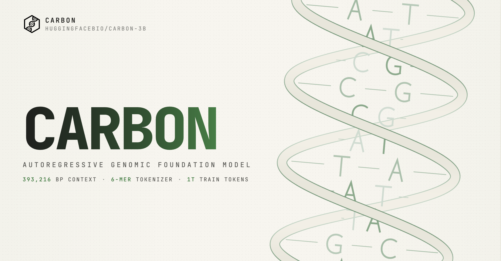
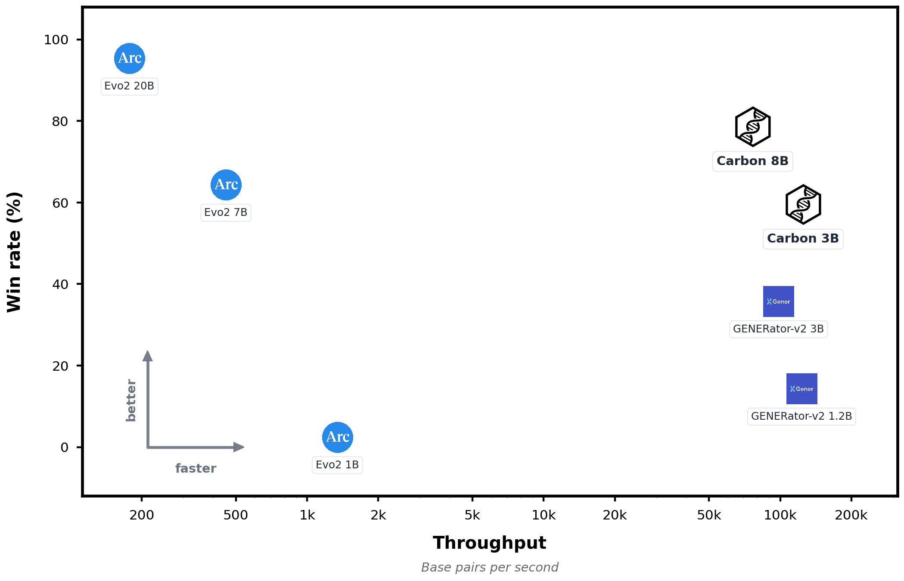
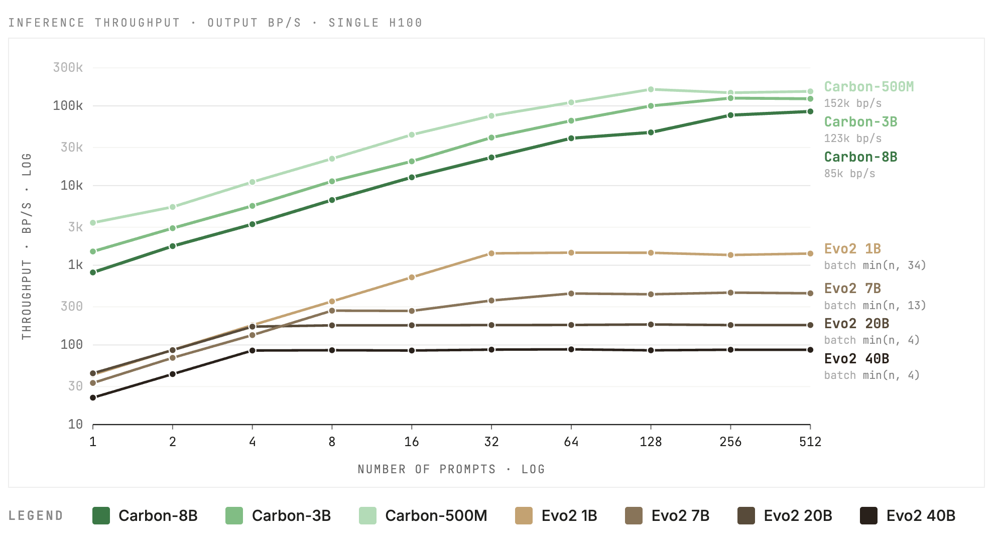

<p align="center">
  <a href="https://huggingface.co/HuggingFaceBio/Carbon-3B/blob/main/tech-report.pdf"><b>Technical Report</b> 🧬</a>
</p>

# Carbon-3B

A generative DNA foundation model from the **Carbon** family.

## Table of Contents

1. [Model Summary](#model-summary)
2. [How to use](#how-to-use)
3. [Evaluation](#evaluation)
4. [Training](#training)
5. [Limitations](#limitations)
6. [License](#license)
7. [Acknowledgements](#acknowledgements)

## Model Summary

<p align="center">
    
</p>

**Carbon-3B** is a 3B-parameter decoder-only autoregressive genomic foundation model trained on DNA and RNA sequences, with a primary focus on eukaryotes. It has a native context length of **32,768 6-mer tokens (≈ 197k DNA base pairs)** and extends to **65,536 tokens (≈ 393 kbp)** at inference time via YaRN. Carbon-3B is designed to be both strong and efficient: on generative tasks (sequence recovery), variant-effect prediction, and motif-perturbation discrimination, it matches the capability of substantially larger single-nucleotide baselines such as Evo2-7B while running several times faster.

Carbon-3B is the **flagship** model of the Carbon family. We also release [**Carbon-8B**](https://huggingface.co/HuggingFaceBio/) for users who need additional capability at higher inference cost, and [**Carbon-500M**](https://huggingface.co/HuggingFaceBio/) — a small generative model intended for speculative decoding alongside Carbon-3B (or Carbon-8B).
- Technical report: https://github.com/huggingface/carbon/blob/main/tech-report.pdf
- Demo: https://huggingface.co/spaces/HuggingFaceBio/carbon-demo

### Key features

- **3B parameters**, 30 layers, hidden size 3072, GQA (32 heads, 4 KV groups), SwiGLU, RMSNorm.
- **Hybrid tokenizer**: non-overlapping 6-mer tokenization for DNA combined with the [Qwen3](https://huggingface.co/Qwen/Qwen3-4B) BPE vocabulary for English text. We found 6-mer tokenization to work substantially better than BPE for DNA — hence the hybrid setup, which keeps 6-mer for DNA while preserving a BPE vocabulary for future joint English + DNA training, the direction in which we believe genomic foundation models should converge. Each DNA token encodes 6 nucleotides, so 1 DNA token ≈ 6 bp.
- **Native context: 32,768 tokens ≈ 197 kbp.** Extendable to 65,536 tokens (≈ 393 kbp) at inference time using YaRN.
- **Trained with a Cross-Entropy → Factorised Nucleotide Supervision (FNS) objective schedule** to bridge coarse tokenization and single-nucleotide resolution (see the Carbon technical report).
- **Metadata-conditioned**: optional species-type and gene-type metadata tokens enable conditional generation.
- **Efficient inference**: compatible with vLLM and other inference engines. Can generate over 100,000 base-pairs per second on a single H100 GPU. 

Across our zero-shot evaluation suite, sequence recovery, four variant-effect-prediction (VEP) benchmarks (ClinVar coding, ClinVar non-coding, BRCA2, TraitGym Mendelian), and two sequence-level perturbation tasks (nucleotide triplet-expansion and synonymous codon replacement), Carbon-3B is competitive with Evo2-7B. It additionally works well on long context and retrieves needles reliably from up to ≈ 393 kbp of distal context on the Genomic-NIAH long-context benchmark, while remaining several times faster than Evo2-7B.
For full design rationale and ablations, see the Carbon technical report and the [Carbon GitHub repository](https://github.com/huggingface/carbon).

## How to use

Carbon-3B is a standard Hugging Face causal LM. The custom DNA tokenizer requires `trust_remote_code=True` on the tokenizer; the model itself is stock `LlamaForCausalLM` and does not require it.

```bash
pip install -U transformers
```

```python
from transformers import AutoModelForCausalLM, AutoTokenizer
import torch

repo = "HuggingFaceBio/Carbon-3B"

tok = AutoTokenizer.from_pretrained(repo, trust_remote_code=True)
model = AutoModelForCausalLM.from_pretrained(
    repo,
    dtype=torch.bfloat16,
).cuda().eval()

# Wrap a DNA prompt with the <dna> tag (the model is trained with this format).
# DNA length should be a multiple of 6 — see the Tokenizer section below.
dna_prompt = "ATGCGCTAGCTACGATCGATCGTAGCTAGCTAGCTAGCTACG"   # 42 bp = 7 × 6-mer
prompt = f"<dna>{dna_prompt}"

inputs = tok(prompt, return_tensors="pt", add_special_tokens=False).to("cuda")
out = model.generate(
    **inputs,
    max_new_tokens=64,
    do_sample=False,
)
print(tok.decode(out[0][inputs.input_ids.shape[1]:], skip_special_tokens=True))
```

### Tokenizer: working with DNA inputs

The Carbon tokenizer is a **hybrid** of BPE (for English text) and a fixed 6-mer scheme (for DNA). 6-mer tokenization is the central DNA-modeling design choice in Carbon — we found it works substantially better than BPE for DNA (see the Carbon technical report for the analysis) — but it comes with a few practical constraints when feeding input to the model. The tokenizer only switches into 6-mer mode when it sees the `<dna>` tag and emits `<oov>` token for any token with letters not in [ATCG].

#### 1. Always wrap DNA sequences with `<dna>` — this is critical

If you pass a raw DNA sequence **without** the `<dna>` tag, the tokenizer treats it as English text and applies BPE. BPE-tokenized DNA is essentially a different language for Carbon-3B, and performance collapses across every benchmark. Always prepend `<dna>` before any DNA content. Use `</dna>` to close the DNA block if you intend to follow it with non-DNA tokens.

```python
# ❌ Wrong — tokenized as BPE, performance collapses
prompt = "ATGCGCTAGCTACGATCGATCGTAGCTAGCTAG"

# ✅ Correct — `<dna>` flips the tokenizer into 6-mer mode, for generation
prompt = "<dna>ATGCGCTAGCTACGATCGATCGTAGCTAGCTAG"

# ✅ Also correct — explicitly close the DNA block
prompt = "<dna>ATGCGCTAGCTACGATCGATCGTAGCTAGCTAG</dna>"
```

The `<dna>` / `</dna>` tell the tokenizer where to switch modes.

#### 2. Only uppercase A, C, G, T are in the 6-mer vocab

Anything else inside a `<dna>...` block — lowercase bases, IUPAC ambiguity codes (`N`, `Y`, `R`, …), or any other character — is mapped to the `<oov>` token. Filter to canonical uppercase ACGT before passing input if you don't want `<oov>`.

#### 3. DNA length should be a multiple of 6

Each DNA token encodes 6 nucleotides, so the tokenizer groups input in non-overlapping 6-mer blocks. If the sequence is not a multiple of 6, the current tokenizer right-pads the trailing partial block with `A`s (e.g. `...CTAG` → token `TAGAAA`). We recommend truncating to a multiple of 6 before passing the sequence in:

```python
def truncate_to_6mer(seq: str) -> str:
    return seq[: (len(seq) // 6) * 6]

prompt = f"<dna>{truncate_to_6mer(seq)}"
```

### Likelihood-based scoring

For variant-effect or perturbation tasks, score sequences with the model's per-token log-probabilities. A minimal single-sequence helper:

```python
import torch
import torch.nn.functional as F

@torch.no_grad()
def score(seq: str) -> float:
    """Mean log-prob per DNA token of `seq` (single sequence, no padding)."""
    text = f"<dna>{seq}</dna>"
    ids = tok(text, return_tensors="pt", add_special_tokens=False).input_ids.to(model.device)
    logits = model(ids).logits[:, :-1, :]
    targets = ids[:, 1:]
    logp = F.log_softmax(logits.float(), dim=-1).gather(-1, targets.unsqueeze(-1)).squeeze(-1)
    return logp.mean().item()
```

For batched scoring with attention masking and full reproducible evaluation pipelines (sequence recovery, ClinVar / BRCA2 / TraitGym VEP, triplet-expansion / synonymous codon replacement, Genomic-NIAH), use the official scripts in the [Carbon evaluation directory](https://github.com/huggingface/carbon/tree/main/evaluation) — see [`perturbation_tasks.py`](https://github.com/huggingface/carbon/blob/main/evaluation/perturbation_tasks.py) for the canonical `score_hf` implementation and [`README.md`](https://github.com/huggingface/carbon/blob/main/evaluation/README.md) for run instructions across all tasks.

### Long context: extending to 65,536 tokens (≈ 393 kbp) with YaRN

The released `config.json` is configured for the native 32 k context. To extend to **65,536 tokens (≈ 393 kbp)** at inference time, override `max_position_embeddings` and add a YaRN `rope_scaling` block. We recommend a **YaRN factor of 4**, which we observed gives better retrieval quality at 64 k than a tighter factor of 2:

```python
from transformers import AutoConfig, AutoModelForCausalLM

config = AutoConfig.from_pretrained(repo, trust_remote_code=True)
config.max_position_embeddings = 65536    # 65,536 tokens ≈ 393 kbp
config.rope_scaling = {
    "type": "yarn",
    "factor": 4.0,
    "original_max_position_embeddings": 32768,
}
model = AutoModelForCausalLM.from_pretrained(
    repo, config=config, dtype=torch.bfloat16
).cuda().eval()
```

We do **not** recommend pushing beyond 64 k tokens: retrieval quality degrades sharply at 128 k context in our benchmarks.

### Speculative decoding with Carbon-500M

Carbon-3B and Carbon-500M share the same tokenizer and DNA template format, so [Carbon-500M](https://huggingface.co/HuggingFaceBio/) can be used as a draft model for speculative decoding with Carbon-3B (or Carbon-8B) as the target model, reducing wall-clock generation cost at no quality loss.

```python
from transformers import AutoModelForCausalLM, AutoTokenizer
import torch

draft = AutoModelForCausalLM.from_pretrained(
    "HuggingFaceBio/Carbon-500M",
    dtype=torch.bfloat16,
).cuda().eval()
target = model  # Carbon-3B, loaded above

inputs = tok(f"<dna>{dna_prompt}", return_tensors="pt", add_special_tokens=False).to("cuda")
out = target.generate(
    **inputs,
    max_new_tokens=256,
    do_sample=False,
    assistant_model=draft,
)
```

### Conditional generation with metadata

The model is trained with a mixed-template objective; some examples are prefixed with species-type and/or gene-type metadata tokens. Generation can be conditioned on these by prepending the corresponding tokens:

```python
prompt = "<vertebrate_mammalian><protein_coding_region><dna>ATGCGCTAG..."
```

The unconditional `<dna>SEQUENCE</dna>` format remains supported and is the default. See the Carbon technical report for the full list of supported metadata tags.

### Base-pair-level generation and scoring

The `fns` branch loads custom modeling code for Factorized Nucleotide Supervision (FNS). Carbon still uses its efficient 6-mer tokenizer, but during generation each selected 6-mer is assembled from six per-position nucleotide distributions, giving base-pair-level control over decoded DNA. Use this branch when you need exact base-pair counts, per-position masks, or temperature/top-p behavior applied at the nucleotide level rather than over the 4,096-way 6-mer distribution:

```py
import math
import torch
from transformers import AutoModelForCausalLM, AutoTokenizer

model_id = "HuggingFaceBio/Carbon-3B"
revision = "fns"
device = "cuda"

tokenizer = AutoTokenizer.from_pretrained(model_id, revision=revision, trust_remote_code=True)
model = AutoModelForCausalLM.from_pretrained(
    model_id,
    revision=revision,
    trust_remote_code=True,
    dtype=torch.bfloat16,
).to(device).eval()

context = "ATGCGCTAGCTACGATCGATCGTAGCTAGCTAGCTAGCTACG"
n_bp = 60

inputs = tokenizer(f"<dna>{context}", return_tensors="pt", add_special_tokens=False).to(device)

with torch.no_grad():
    output_ids = model.generate(
        **inputs,
        max_new_tokens=math.ceil(n_bp / tokenizer.k),
        do_sample=False,
        pad_token_id=tokenizer.eos_token_id,
    )

generated_ids = output_ids[0, inputs.input_ids.shape[1]:]
generated_dna = tokenizer.decode(generated_ids, skip_special_tokens=True)[:n_bp]

print(generated_dna)
```

The same per-base marginals are exposed through `score_sequence()`, which returns the probability assigned to the observed base at each position. Taking the mean log probability gives a base-pair-level sequence score, where higher values indicate higher model likelihood:

```py
import torch
from transformers import AutoModelForCausalLM, AutoTokenizer

model_id = "HuggingFaceBio/Carbon-3B"
revision = "fns"
device = "cuda"

tokenizer = AutoTokenizer.from_pretrained(model_id, revision=revision, trust_remote_code=True)
model = AutoModelForCausalLM.from_pretrained(
    model_id,
    revision=revision,
    trust_remote_code=True,
    dtype=torch.bfloat16,
).to(device).eval()

reference = "GGGCTATAAAGGCCATCGATCGATCGATCGATCGATCGATCG"
perturbed = "GGGCGCGCGCGGCCATCGATCGATCGATCGATCGATCGATCG"

with torch.no_grad():
    bp_probs, actual_probs = model.score_sequence([reference, perturbed])

scores = [torch.log(p.clamp_min(1e-12)).mean().item() for p in actual_probs]

print(f"reference mean bp logp: {scores[0]:.4f}")
print(f"perturbed mean bp logp: {scores[1]:.4f}")
print(f"reference preferred: {scores[0] > scores[1]}")
```

## Evaluation

All evaluations are zero-shot and use the [public Carbon evaluation pipeline](https://github.com/huggingface/carbon/tree/main/evaluation). The suite covers seven tasks across four capability families:

| Family | Task | Metric |
|---|---|---|
| Generative | **Sequence recovery** (eukaryote, bacteria, others splits) | Per-base accuracy on the next 30 bp |
| Variant-effect prediction (VEP) | **ClinVar coding** | AUROC, AUPRC (right-end / next-token scoring) |
| | **ClinVar non-coding** | AUROC, AUPRC |
| | **BRCA2** | AUROC, AUPRC, Spearman ρ (centered 8 kb window, full-LL delta) |
| | **TraitGym Mendelian** | AUROC, AUPRC, Spearman ρ |
| Sequence-level perturbation | **Nucleotide triplet-expansion** (insert 10 consecutive CAG triplets into a CDS; model should prefer the natural reference) | Pairwise discrimination accuracy |
| | **Synonymous codon replacement** (replace every codon with the highest-frequency synonym for the target species; model should prefer the natural reference) | Pairwise discrimination accuracy |
| Long-context retrieval | **Genomic-NIAH** (4 task variants × 6 context lengths, up to 786 kbp) | `gen_exact_match`, `ll_correct` |


Below we highlight the three short-context probes for which we report headline numbers in this card. Full results, including all VEP benchmarks and Genomic-NIAH heatmaps, are in the Carbon technical report.

### Downstream tasks

 | Category | Metric (%) | Carbon 3B | GENERator-v2 3B | Evo2 7B |
  |---|---|---|---|---|
  | Generative | Sequence Recovery eukaryote | **61.54** | 58.56 | <u>59.86</u> |
  | Variant effect prediction | BRCA2 | **84.63** | 81.93 | <u>83.52</u> |
  | | TraitGym Mendelian | <u>33.65</u> | 27.91 | **37.78** |
  | | ClinVar coding (24 kb) | <u>92.89</u> | 91.55 | **93.33** |
  | | ClinVar non-coding (24 kb) | **91.14** | <u>90.13</u> | 89.79 |
  | Perturbation | Nucleotide triplet-expansion | <u>85.20</u> | 83.06 | **88.43** |
  | | Synonymous codon | <u>88.89</u> | 87.03 | **91.59** |

Carbon-3B is competitive with Evo2-7B while being much faster to run.

### Long-context retrieval (Genomic-NIAH)

[Genomic-NIAH](https://huggingface.co/datasets/HuggingFaceBio/genomic-niah) is a long context benchmark, inspired from NIAH and RULER benchmarks for English. The model needs to retrieves a random 24 bp VALUE planted in a real-genome haystack at one of five depths, evaluated at six context lengths from 24 kbp to 786 kbp. The benchmark contains 500 examples per (task, context) cell.

Below are the scores on `niah`:
| Context length         | Carbon 3B 32k (native / YaRN 4×) | GENERator-v2 3B | Evo2-7B |
|------------------------|----------------------------------|-----------------|---------|
| 16 k tokens (98 kbp)   | 0.73 / —                         | 0.74            | 0.97    |
| 32 k tokens (196 kbp)  | 0.55 / 0.90                      | —               | 0.95    |
| 64 k tokens (393 kbp)  | — / 0.79       | —               | 0.80    |

Sample sizes: Carbon & GENERator n=500. Evo2-7B n=150 at 16k, n=100 at 32k, n=100 at 64k due to the slow inference speed.

- **4× longer effective context than Generator-v2-3B.** Generator-v2-3B caps at 16 k tokens (≈ 98 kbp). Carbon-3B has a native context of 32 k tokens (≈ 197 kbp) and extends to 65,536 tokens (≈ 393 kbp) at inference time with YaRN. It matches Generator-v2-3B on `niah` at 98 kbp.
- **Matches Evo2-7B (1 M context) on `niah` at 393 kbp** (64 k tokens) under YaRN, despite being substantially smaller.
- **YaRN helps at the native-context boundary.** At 32 k tokens (≈ 197 kbp), retrieval quality near the model's native maximum begins to degrade; applying YaRN at inference time smooths the boundary and recovers most of the lost accuracy.


### Inference efficiency

Carbon models run natively in vLLM and thus generate DNA sequences over 150 times faster than the Evo2 family of models. Below we show the results of a throughput benchmark, where 1080 base-pairs are used for prefill and decode with increasing number of input sequences. All models except Evo2 40B were run on a H100 GPU, with the batch size of the Evo2 models tuned to the largest possible size that fits in VRAM.



## Training

### Model

- **Architecture:** decoder-only Transformer (Llama-style), 30 layers, hidden 3072, FFN 8448, 32 attention heads with GQA (4 KV groups), SwiGLU, RMSNorm.
- **Tokenizer:** Carbon 6-mer hybrid (vocab ≈ 156 k including DNA tags and metadata tokens and BPE tokens for future English & DNA continual pretraining).
- **Precision:** bfloat16
- **Positional embedding:** RoPE, base θ = 5 × 10^6, max position 32,768.

### Pre-training

Carbon-3B is pre-trained for **1T 6-mer tokens (≈ 6T DNA base pairs)** at sequence length 8 192, with a global batch size of 256 sequences (≈ 2 M tokens / step). The optimizer is AdamW throughout.

The data mixture during the stable phases of pre-training (Phase 1 and the stable portion of Phase 2) is the one documented on the [`HuggingFaceBio/carbon-pretraining-corpus` dataset card](https://huggingface.co/datasets/HuggingFaceBio/carbon-pretraining-corpus): ≈ 70 % Generator-style eukaryotic genomic DNA, with mRNA, splice-enriched mRNA, and GTDB bacterial genomes alongside metadata-conditioned templates.

The training uses a **staged objective and learning-rate schedule**:

- **Phase 1 — Cross-Entropy (0 → 100B tokens)**. WSD learning-rate schedule with peak LR = 3e-4 and a 2,000-step linear warmup, then stable at peak through the end of Phase 1.
- **Phase 2 — Factorised Nucleotide Supervision (100B → 1T tokens)**. Switch to the hybrid FNS loss, lower the peak LR to 2e-5, and continue with a WSD schedule whose decay phase covers the last 20% of Phase-2 steps. During the decay phase, we rebalance the data mixture to upsample mRNA and prokaryotic data — we found that mRNA in particular meaningfully helps downstream tasks — using the following ratios: 50% Generator-style eukaryotic genes · 25% mature mRNA · 10% splice-enriched mRNA · 15% GTDB bacterial genomes.

See the Carbon technical report for the full pre-training recipe.

### Long-context training

After pre-training, the model undergoes continued training for 50B additional tokens at sequence length 32,768, with the rotary base shifted from 5 × 10^5 to 5 × 10^6. The long-context training mixture is:

| Component | Fraction |
|---|---|
| Gener-style annotated genes (metadata-conditioned) | 35.0 % |
| Concatenated annotated genes (long-context-data) | 13.8 % |
| mRNA transcripts | 25.0 % |
| Splice-enriched mRNA | 10.0 % |
| GTDB bacterial genomes | 15.0 % |
| Promoter sequences | 1.2 % |

The optimizer is AdamW (β₁ = 0.9, β₂ = 0.95, ε = 1e-8, weight decay = 0.1, gradient clipping = 1.0), with a WSD learning-rate schedule: 2,000 steps linear warmup from 0 to 3e-5, stable phase, then 4,000-step linear decay to 3e-6. Global batch size: 64 sequences × 32,768 tokens.

### Software & hardware

- **GPUs:** 128 H100 (16 nodes × 8 H100).
- **Wall clock (long-context phase):** ≈ 35 hours.
- **Training framework:** [Megatron-LM](https://github.com/NVIDIA/Megatron-LM) with the Carbon patch [Megatron-LM-Carbon](https://github.com/huggingface/Megatron-LM-Carbon).
- **Conversion:** [Megatron-Bridge](https://github.com/NVIDIA/Megatron-Bridge) (Megatron → Hugging Face).

## Limitations

- ⚠️ **Genetic data is highly sensitive.** Depending on how this model is used (local download, inference API/endpoints, third-party inference providers, Spaces demos or others), input and output data may be processed or handled differently by different providers or space owners. Please make sure you understand and agree with how your data is handled before using the model.
- **Primarily eukaryotic training.** Carbon-3B is trained mostly on eukaryotic genomic and transcript sequence; the pre-training mixture deliberately includes a smaller prokaryotic component (GTDB bacterial genomes) so that continual pre-training on prokaryotic data remains straightforward. Despite this modest prokaryotic share, we observed consistent gains on prokaryotic sequence recovery throughout training, and Carbon-3B already **matches [GENERator-v2-prokaryote-3B](https://huggingface.co/GenerTeam/GENERator-v2-prokaryote-3b-base)** — a model trained specifically on prokaryotes — on the prokaryote sequence-recovery split. We expect that a short continued-training phase on prokaryotic data would deliver substantially stronger prokaryote-specific performance.
- **YaRN beyond 64 k tokens degrades.** YaRN reliably extends Carbon-3B to 65,536 tokens (≈ 393 kbp) at inference time with `factor=4`. Pushing further to 128 k tokens (≈ 786 kbp) causes retrieval quality to drop sharply in our long-context benchmarks.

## License

Apache 2.0.

## Acknowledgements

Carbon is a joint collaboration between the research teams at Hugging Face, Zhongguancun Academy, and TIGEM/University of Naples “Federico II”.

## Citation

```
@article{allal2026carbon,
  title={Carbon: Decoding the Language of Life},
  author={Allal, Loubna Ben and Li, Qiuyi and Fiusco, Maurizio and Tunstall, Lewis and Rasul, Kashif and Beeching, Ed and Aubakirova, Dana and Pati{\~n}o, Carlos and Frere, Thibaud and Lozhkov, Anton and others},
  journal={bioRxiv},
  pages={2026--05},
  year={2026},
  publisher={Cold Spring Harbor Laboratory}
}
```